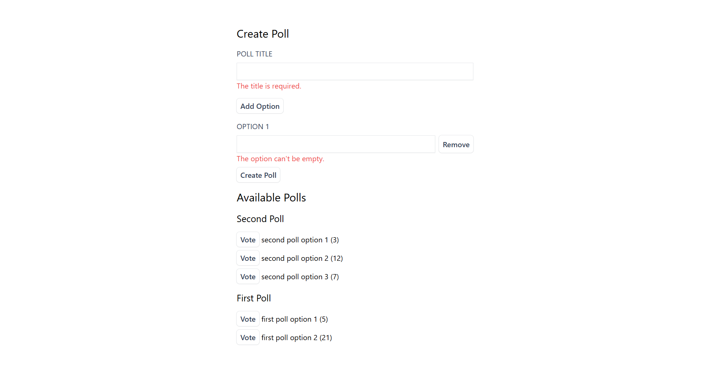

## Laravel Livewire Poll
output:

Developed a dynamic polling system with Laravel Livewire, ensuring seamless real-time interactions and structured data management via Eloquent ORM. Each poll accommodates multiple options through a one-to-many relationship, while votes are systematically linked to options, maintaining relational integrity and scalability.

